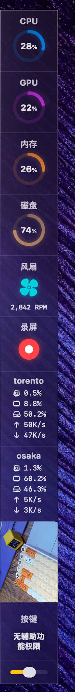
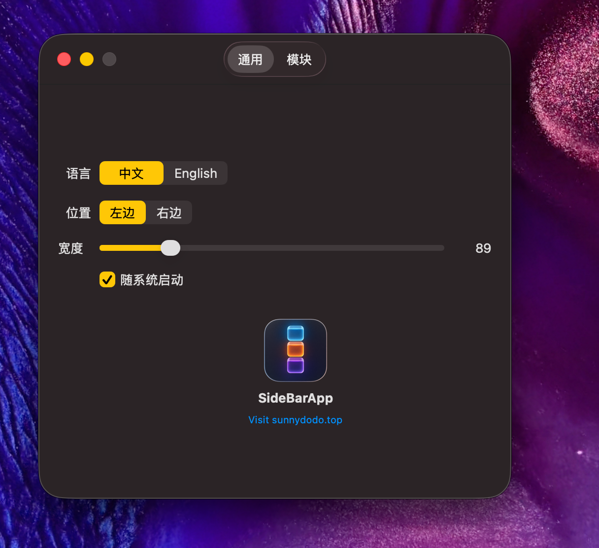
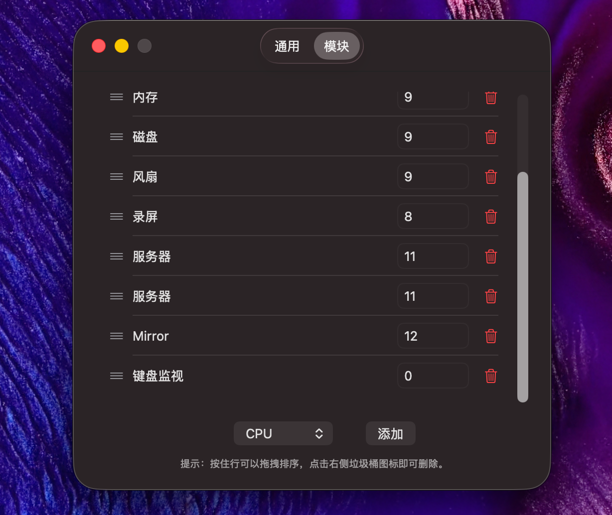

# Sidebay - macOS 动态侧边栏组件工具箱
# Sidebay - Dynamic Modular Sidebar for macOS

---

## 📸 Screenshots / 截图

  
  
  

## 🆕 Recent Updates / 最新更新

- **后台设置界面升级 (Settings UI Overhaul)**: 采用 macOS 原生 TabView 设计，将“通用”与“模块”设置分离，彻底解决了模块过多时显示不全的问题，并提升了整体美观度。
- **Settings UI Overhaul**: Redesigned the backend settings with a native macOS TabView, separating "General" and "Modules" options for better visibility and a cleaner aesthetic.

---

## 🇨🇳 中文说明

**Sidebay** 是一款专为 macOS 设计的无边框、悬浮式、高颜值侧边栏小工具集合。它贴合在屏幕边缘，完全不占用你的 Dock 栏，并且拥有极致的半透明毛玻璃视觉体验。

### ✨ 核心特性

- **模块化自由定制**：你可以通过设置后台（点击侧边栏底部的⚙️图标），自由添加、删除、以及上下拖拽排序所有的功能模块。
- **动态宽度与透明度**：鼠标悬停在侧边栏右边缘即可通过拖拽改变宽度。底部自带透明度滑块，背景毛玻璃效果随心调。
- **无感沉浸体验**：作为一个系统级的辅助应用 (Accessory App)，它不会在 Dock 栏出现，关闭设置后台也不会退出程序。

### 📦 内置模块大全

- **系统监视器 (CPU / GPU / RAM / Disk)**：带有光影和角度渐变的炫酷环形进度条，实时显示系统硬件资源占用。
- **网络流速 (Network)**：上下行网速实时监控。
- **风扇状态 (Fan)**：平滑旋转的炫酷风扇图标与模拟系统转速。
- **自选股看板 (Stock)**：支持同时添加无限个股票模块。双击即可输入股票代码（如 `sh000001`, `sz002594`），实时获取腾讯财经最新行情。
- **时间管理 (Countdown / Stopwatch)**：番茄钟倒计时与精密秒表。双击倒计时数字可自定义时长。
- **微型计算器 (Calculator)**：专为狭长侧边栏设计的 4x5 极简科学计算器，日常算数无需打开主程序。
- **全局键盘监视器 (Keyboard)**：实时显示你按下的快捷键组合（如 `⌘ ⇧ A`），非常适合教学录屏。
- **录屏快开 (Screen Record)**：一键呼出 macOS 自带的原生截屏与录屏工具。

### 🚀 如何使用

1. 确保安装了最新版本的 Xcode 或 Swift 命令行工具。
2. 在项目根目录运行 `./build.sh` 编译应用。
3. 双击 `SideBarApp.app` 运行。
4. **键盘监视器注意**：如果你添加了 `Keyboard` 模块，请前往 macOS 的 `系统设置 -> 隐私与安全性 -> 辅助功能`，为你运行该程序的终端（如 Terminal）开启辅助功能权限。

---

## 🇺🇸 English Documentation

**Sidebay** is a borderless, floating, aesthetically pleasing modular sidebar utility for macOS. It sticks seamlessly to the edge of your screen without occupying space in your Dock, featuring a stunning translucent frosted-glass visual experience.

### ✨ Core Features

- **Modular & Customizable**: Access the Settings panel (via the ⚙️ icon at the bottom) to freely add, remove, or drag-and-drop to reorder all functional modules.
- **Dynamic Width & Opacity**: Hover over the right edge to drag and resize the sidebar. Use the bottom slider to instantly adjust the frosted-glass opacity.
- **Immersive Accessory App**: Runs as a pure system accessory. It won't clutter your Dock, and closing the settings window will safely keep the sidebar running in the background.

### 📦 Built-in Modules

- **System Monitors (CPU / GPU / RAM / Disk)**: Sleek circular progress rings with angular gradients and subtle drop shadows indicating real-time hardware usage.
- **Network Speed**: Real-time upload and download tracking.
- **Fan Status**: A smoothly rotating fan icon alongside RPM metrics.
- **Stock Trackers**: Add as many stock modules as you like! Double-click to input ticker symbols (e.g., `sh000001`, `AAPL` if supported by Tencent API) for live market data.
- **Time Management (Countdown / Stopwatch)**: Pomodoro countdowns and precision stopwatches. Double-click the countdown to set custom minutes.
- **Mini Calculator**: A 4x5 minimalist calculator perfectly scaled for the narrow sidebar. Do quick math without opening another app.
- **Global Keyboard Monitor**: Displays your live keystrokes and modifier combos (e.g., `⌘ ⇧ A`). Perfect for tutorials and screen recordings.
- **Screen Record Launcher**: One-click launch for macOS's native screenshot and recording tool.

### 🚀 How to Run

1. Ensure you have the latest version of Xcode or Swift command-line tools installed.
2. Run `./build.sh` in the project root to compile the application.
3. Double-click `SideBarApp.app` to launch.
4. **Keyboard Monitor Note**: To use the `Keyboard` module, you MUST grant Accessibility permissions. Go to `System Settings -> Privacy & Security -> Accessibility` and check the box for the terminal application you used to launch the app.
