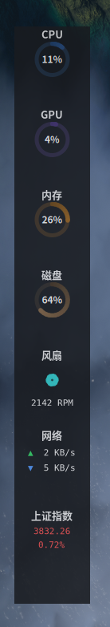

# Sidebay Linux — 动态模块化侧边栏（v0.1）

> **原仓库声明**：本项目源自 [linlinsunny/sidebay](https://github.com/linlinsunny/sidebay)（macOS 原生 SwiftUI 版，MIT 协议）。
> 本仓库为 **Linux/GNOME 移植实现**（Python + GTK4），全部代码位于 `sidebay/` 目录，
> 原 macOS 代码见原仓库。感谢原作者的创意与设计。

<p align="center">
  
</p>

**Sidebay** 是一款无边框、悬浮式、深色玻璃质感的模块化侧边栏小工具。它贴合屏幕边缘
（或自由定位），实时显示系统状态与常用小工具，完全可自定义。

---

## ✨ 特性一览

- **11 个内置模块**：CPU / GPU / 内存 / 磁盘 环形仪表（百分比绘制在环心）、网络上下行、
  风扇、自选股（腾讯行情）、番茄钟倒计时、秒表、极简计算器、键盘监视
- **深色玻璃质感**：统一纯色玻璃背景 + 渐变描边 + 投影，无任何 GNOME 原生菜单栏/标题栏
- **自由定位**：设置页 X/Y 坐标实时移动窗口（含垂直 Y），支持任意屏幕位置
- **样式控制**：字号（小/中/大）、字体族、背景透明度、窗口宽度/高度均可调
- **模块管理**：长按侧边栏进入设置，增删模块、拖拽排序、逐模块高度与**采集频率**（1s~60m）
- **双语界面**：中文 / English
- **低资源占用**：空闲 RSS ≈ 93MB，`/proc` 读取微秒级，GPU 查询自动节流
- **顶部面板托盘**：启动即显示侧边栏且不进 Dock，顶栏 Logo 控制显示/隐藏、设置、退出
- **随包默认参数**：新装直接以预设的位置/尺寸/样式/模块启动（default-config.json）
- **Flatpak 打包**：一键构建安装，含应用图标与启动器；进程名为 `sidebay`

---

## 🖥️ 与原版的差异（Linux 移植说明）

| 维度 | macOS 原版 | Linux 版 |
|---|---|---|
| 技术栈 | SwiftUI + AppKit | Python 3.10+ + GTK 4（PyGObject） |
| 窗口 | NSPanel 贴边悬浮 | 无装饰 GTK 窗口；XWayland/X11 下 X/Y 自由定位 |
| 毛玻璃 | NSVisualEffectView（真实模糊） | 纯色半透明玻璃（GNOME Wayland 无窗口模糊） |
| 硬件采集 | mach / IOKit / SMC | /proc、/sys、statvfs、nvidia-smi |
| 键盘监视 | CGEvent 全局捕获 | X11 XRecord（Wayland 下显示无权限） |
| 模块 | 13 个 | 11 个（Mirror 摄像头、录屏、远程服务器为 V2） |
| 打包 | .app bundle | uv 工程 + Flatpak |

---

## 📦 快速开始

### 系统依赖（Ubuntu/Debian 示例）

```bash
sudo apt install python3 python3-gi python3-gi-cairo gir1.2-gtk-4.0 xvfb uv
```

> 其他发行版安装 `python3-gobject`、`gtk4`、`uv` 对应包即可。

### 安装与运行

```bash
uv venv --system-site-packages   # 首次：创建环境（gi 来自系统包，需 system-site-packages）
uv sync                          # 安装依赖（pytest、python-xlib）
./run.sh                         # 启动
```

> `./run.sh` 首次运行会自动完成上述两步；Wayland 会话下自动走 XWayland 以获得完整定位能力。

### 测试

```bash
uv run pytest                                # 全量测试（80 项）
GDK_BACKEND=x11 xvfb-run -a uv run pytest    # 无显示器环境跑 UI 冒烟
```

### Flatpak 构建安装

```bash
./install.sh                                 # flatpak-builder 构建并安装
flatpak run org.sidebay.SideBay              # 运行
```

---

## 🎮 使用教程

### 1. 托盘与设置页

- **顶栏 Logo**：左键弹出菜单（显示/隐藏侧边栏、设置、退出）；侧边栏窗口不显示在 Dock/任务栏
- **长按侧边栏任意位置约 1.5 秒** → 弹出设置窗口
- 或右键侧边栏 → 「后台设置」

### 2. 设置页详解

**通用页**

| 控件 | 说明 |
|---|---|
| 语言 | 中文 / English 即时切换 |
| 位置 | 左 / 右贴边（与 X/Y 坐标二选一使用） |
| 宽度 | 侧边栏宽度 40-300px，**实时生效** |
| X/Y | 窗口左上角坐标，**实时移动**（任意位置；配合高度控件可摆到屏幕任意处） |
| 高度 | 窗口高度（设短后内容滚动，且 Y 坐标可自由移动） |
| 字号 / 字体 | 小/中/大 × 6 种字体族，即时生效 |
| 透明度 | 背景透明度 0.1-1.0 |
| 随系统启动 | 写入 `~/.config/autostart/sidebay.desktop` |

**模块页**

- **添加**：底部下拉选择模块类型 → 「添加」
- **删除**：行尾 🗑
- **排序**：按住行首 `⋮⋮` 拖拽
- **高度百分比**：行内数字框（0 = 默认 100px）
- **采集频率**：行内下拉 **1s / 2s / 5s / 10s / 10m / 20m / 60m** —— 低频监控项可大幅降低开销
- **股票代码**：股票行内输入框直接改代码（如 `sh000001`、`sz002594`）

### 3. 模块使用

| 模块 | 交互 |
|---|---|
| CPU/GPU/内存/磁盘 | 环形仪表，百分比在环心；颜色区分（蓝/紫/橙/棕） |
| 网络 | ▲ 上传（绿）▼ 下载（蓝），自动单位 B/KB/MB/s |
| 风扇 | 扇叶随 RPM 旋转；无真实传感器时按负载模拟 |
| 股票 | 双击价格进入编辑，回车提交；涨红跌绿 |
| 倒计时 | 双击数字设分钟；▶/⏸ 播放暂停，↺ 重置（默认 25 分钟） |
| 秒表 | ▶/⏸ 计时，⏹ 清零 |
| 计算器 | 4×5 极简计算器，支持 ± % 与四则运算 |
| 键盘监视 | X11 会话全局显示按键组合；Wayland 下显示「无辅助功能权限」 |

---

## 🛠️ 开发指南

### 项目结构

```
sidebay/
├── sidebay/
│   ├── main.py      # 入口：进程名 sidebay、自动选 XWayland、GSK_RENDERER=cairo
│   ├── app.py       # Gtk.Application（单实例、设置窗口管理）
│   ├── window.py    # 侧边栏窗口：定位/贴边/长按手势/边缘拖宽
│   ├── settings.py  # 设置窗口（自绘标签行）
│   ├── store.py     # 配置持久化（JSON，XDG 路径；无配置时读 default-config.json）
│   ├── default-config.json  # 随包默认启动参数（新装即用）
│   ├── monitor.py   # 系统采集（/proc、/sys 纯函数解析 + 采样类）
│   ├── autostart.py # 开机自启
│   ├── widgets/
│   │   ├── ring.py  # cairo 环形仪表（角度渐变 + 中心文本）
│   │   └── ...
│   ├── modules/     # 11 个模块，统一 Module 接口
│   │   ├── base.py  # 基类：build()/on_tick()/should_update() 频率节流
│   │   ├── registry.py
│   │   └── usage/network/fan/stock/countdown/stopwatch/calculator/keyboard.py
│   └── style.css    # 深色玻璃质感样式
├── tests/           # 80 项 pytest（纯逻辑 + xvfb 冒烟）
├── logos/           # 应用图标（sidebay.png / sidebay-512.png）
├── org.sidebay.SideBay.json  # Flatpak manifest
├── org.sidebay.SideBay.desktop
├── run.sh / install.sh
├── pyproject.toml   # uv 工程（dev 依赖组：pytest、python-xlib）
└── docs/superpowers/    # 设计文档与实施计划
```

### 架构要点

- **数据流**：`SystemMonitor.tick()`（1s）→ 各模块 `on_tick()` → UI 更新；
  模块频率经 `should_update()` 节流，低频模块不做事
- **采集语义对齐标准工具**：CPU 的 idle 含 iowait、guest 不双计（与 htop 一致）；
  内存 = total − MemAvailable（与 `free` 一致）；磁盘百分比用 df 公式；
  网络 up=发送(tx)、down=接收(rx)，排除虚拟/隧道接口
- **定位策略**：XWayland/X11 下 `XMoveResizeWindow` 定位（Mutter 初始放置期
  自动重试 500ms/2s/5s）；设置页 X/Y 实时移动
- **UI 无原生控件**：全部窗口 `set_decorated(False)`，标签行/关闭按钮/滑块均自绘样式

### 开发流程

```bash
uv run pytest                     # 改代码后全量测试
./run.sh                          # 手动验证
uv run --no-sync sidebay          # 等价于 ./run.sh
```

**添加新模块**（示例：假设新增「天气」）：

1. `sidebay/modules/weather.py`：继承 `Module`，实现 `build()` 与 `on_tick()`
2. `registry.py`：`MODULE_TYPES` 加 `"Weather"`，`create_module` 加分支
3. `window.py` `rebuild_modules` 的白名单加 `"Weather"`
4. `i18n.py` 加 `"Weather"` 词条
5. 补测试（纯逻辑部分 pytest，UI 挂载进冒烟）

### 性能与内存

- 空闲 RSS ≈ 93MB（GSK_RENDERER=cairo 渲染器；GL 在无 GPU 环境可达 270MB）
- `/proc` 采样微秒级；nvidia-smi 自动节流 ≥3s
- 低功耗用法：监控模块频率设 5s~60m

---

## ⚠️ 已知限制

| 限制 | 说明 |
|---|---|
| Wayland 置顶 | GNOME Wayland 无 keep-above，全屏窗口会盖住侧边栏（X11 会话正常） |
| 键盘监视 | 仅 X11 会话可用（XRecord）；Wayland 显示「无权限」 |
| 背景模糊 | GNOME Wayland 无窗口模糊 API，玻璃效果为半透明模拟 |
| GPU 采集 | Flatpak 内：amd/intel 可读 sysfs（正常）；**nvidia 需 nvidia-smi 二进制（沙盒内无）→ 显示 0**——本地运行（./run.sh）nvidia 正常 |
| 垂直定位 | XWayland 下 Y 可移动；全高窗口下移会被系统钳回顶部（配高度控件解决） |
| V2 模块 | Mirror（摄像头）、录屏、远程服务器监控暂未移植 |

---

## ❓ 常见问题

**Q: CPU 数值和其他工具对不上？**
A: 已对齐标准语义（htop/gnome-system-monitor）：idle 含 iowait、guest 不双计。
1 秒采样有瞬时波动属正常，长窗口工具（top 平均）会略有差异。

**Q: 窗口不能移动 / Y 坐标无效？**
A: 确认 `./run.sh` 启动（自动 XWayland）；若手动设了 `GDK_BACKEND=wayland`
则无法定位。Y 移动需先设一个小于屏幕的高度。

**Q: 键盘监视显示无权限？**
A: Wayland 会话无法全局捕获按键（协议限制），X11/Xorg 会话下自动可用。

**Q: 开机自启不生效？**
A: Flatpak 安装时自启写入的是宿主机的 `~/.config/autostart`，确认 `Exec` 行
为 `flatpak run org.sidebay.SideBay`。

---

## 📄 许可

MIT License（沿用原仓库）。macOS 原版版权归 [linlinsunny](https://github.com/linlinsunny) 所有；
Linux 移植实现版权归本仓库作者。
